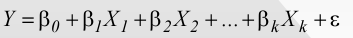
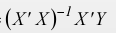
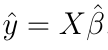
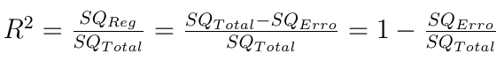

```{r setup, include=FALSE}
knitr::opts_chunk$set(echo = TRUE)

library(dplyr)
library(GGally)
library(ggplot2)
library(gridExtra)
library(rio)
```

# Sobre

Este trabalho foi feito como requerimento da disciplina de **Métodos Estatísticos**. O foco deste é reforçar os conhecimento obtidos sobre o tópico Regressão Linear Múltipla. Seguimos como base os passos descritos neste arquivo <https://r.kyaa.sg/dgfxar.pdf>.

Regressão múltipla é uma coleção de técnicas estatísticas para construir modelos que descrevem de maneira razoável relações entre várias variáveis explicativas de um determinado processo. A diferença entre a regressão linear simples e a múltipla é que na múltipla são tratadas duas ou mais variáveis explicativas. 

## Sobre os dados

```{r}
data = import("dados.xlsx")
```


Os dados utilizados representam o salario, educação e experiência de funcionários. A intenção é determinar o quanto de influência as variáveis educação e experiência podem ter sobre salário.

## Análise Estatística Descritiva
#### (a) Apresente gráficos de dispersão para as variáveis X1 versus Y e X2 versus Y. Há alguma suspeita de relação linear entre as vari ́aveis independentes e dependente?

```{r}
y.x1 = ggplot(data, aes(y=y.salario)) +
  geom_point(aes(x=x1.educacao))
y.x2 = ggplot(data, aes(y=y.salario)) +
  geom_point(aes(x=x2.experiencia))

grid.arrange(y.x1, y.x2, ncol=2)
```

Os gráficos visualmente demonstram ter algum tipo de relação linear, principalmente o referente a dispensão entre experiência e salário. Se olharmos um gráfico com mais informações, poderiamos ter mais confiança com relação a esta dispersão.

## Regressão Linear
#### (b) Realize a análise correlação entre as variáveis envolvidas no estudo; ou seja; estime as correlações lineares entre as variáveis e diga se há suspeita de correlação não nula e, após teste as hipóteses de que cada uma seja nula.

```{r}
cor(data$y.salario, data$x1.educacao)
cor(data$y.salario, data$x2.experiencia)
```


As variáveis Y.salario e X1.educacao tem uma correlação linear de `r cor(data$y.salario, data$x1.educacao)` e entre Y.salario e X2.experiencia existe `r cor(data$y.salario, data$x2.experiencia)`. Em ambos os casos há uma forte correlação entre as variáveis. Visualmente podemos ter:

```{r}
ggpairs(data)
```

Se realizarmos um teste de hipótese em ambas as correlações (pra verificar se a correlação é nula). obtemos para Y.salario e X1.educacao:

```{r}
cor.test(data$y.salario, data$x1.educacao)
```

E para Y.salario e X2.experiencia:

```{r}
cor.test(data$y.salario, data$x2.experiencia)
```

Em ambos os casos o valor p possibilita rejeitar a hipotése de que a correlação é nula.

Com essa certeza, podemos começar a expandir nossa análise para uma regressão linear.

#### (c) Apresente o vetor de estimativas dos coeficientes β_chapeu
Tendo como base:



O cálculo do vetor β_chapeu pode ser feito com a equação:



```{r}
uns = rep(1, nrow(data)) %>% as.matrix()
X = cbind(uns, data$x1.educacao, data$x2.experiencia)

Y = data$y.salario %>% as.matrix()

B_chapeu = solve((t(X) %*% X)) %*% t(X) %*% Y
B_chapeu
```

#### (d) Apresente o vetor de estimativas dos valores previstos y_chapeu = X β_chapeu.

Com base no β_chapeu calculado podemos verificar quais foram nossos valores previstos para o salario, utilizando a fórmula:



```{r}
y_previsto = X %*% B_chapeu
y_previsto
```

#### (e) Calcule a Soma de Quadrados Total (SQTotal) e a Soma de Quadrados de Regressão (SQReg) para então calcular o coeficiente de determinação R² e diga se o modelo de regressão explica bem a variabilidade total dos dados.



Podemos calcular SQTotal e SQErro da seguinte forma:

```{r}
SQRegressao = t(B_chapeu) %*% t(X) %*% Y - nrow(X)*mean(Y)**2

SQResiduo = t(Y) %*% Y - t(B_chapeu) %*% t(X) %*% Y

SQTotal = SQRegressao + SQResiduo

R2 = SQRegressao / SQTotal

R2
```

Como visto o valor R² (`r R2`) foi muito próximo a 1, com base nisso é possível dizer que o modelo explica bem a variabilidade total dos dados.

#### (f) Realize uma ANOVA (Análise de Variância) ao nível de 5% de significância e diga se estatísticamente é significativo dizer que pelo menos uma das variáveis independentes exerce influência sobre a variável dependente/resposta y.

Tendo como hipótese nula que nenhuma variável tem influência sobre o salário podemos fazer uma anova da seguinte maneira, utilizando um nível de 5% de significância.

```{r}
grau_liberdade_regressao = ncol(X) - 1
grau_liberdade_residuo = nrow(X) - grau_liberdade_regressao - 1

Fobservado = (SQRegressao/grau_liberdade_regressao) / (SQResiduo/grau_liberdade_residuo)

Fcritico = qf(0.95, df1=grau_liberdade_regressao, df2=grau_liberdade_residuo)
```

Como Fobservador (`r Fobservado`) é muito maior que o Fcritico (`r Fcritico`), rejeitamos a hipótese nula. Neste caso é estatisticamente significante afirmar que as variáveis exercem sim alguma influência sobre o salário.

#### (g) Realize testes marginais (t de Student) para testar individualmente se cada variável independente exerce infuência sobre a variável dependente y.

```{r}
########## (g) #############
## para educacao
n = nrow(X)
tc = qt(0.975, df=grau_liberdade_residuo)
tc_negativo = -1*tc

Ex = 0
Ey = 0
Ex2 = 0
Ey2 = 0
Exy = 0
for (i in 1:nrow(X)) {
  Ex = Ex + X[i,2]
  Ey = Ey + Y[i]
  Ex2 = Ex2 + X[i,2]**2
  Ey2 = Ey2 + Y[i]**2
  Exy = Exy + X[i,2] * Y[i]
}

r_educacao = (n*Exy - Ex*Ey) / (sqrt(n*Ex2 - Ex**2) * sqrt(n*Ey2 - Ey**2))
t_educacao = r_educacao * sqrt((n-2)/(1-r_educacao**2))

## para experiencia
Ex = 0
Ey = 0
Ex2 = 0
Ey2 = 0
Exy = 0
for (i in 1:nrow(X)) {
  Ex = Ex + X[i,3]
  Ey = Ey + Y[i]
  Ex2 = Ex2 + X[i,3]**2
  Ey2 = Ey2 + Y[i]**2
  Exy = Exy + X[i,3] * Y[i]
}

r_experiencia = (n*Exy - Ex*Ey) / (sqrt(n*Ex2 - Ex**2) * sqrt(n*Ey2 - Ey**2))
t_experiencia = r_experiencia * sqrt((n-2)/(1-r_experiencia**2))
```

Os valores da Região crítica para o teste T de student são (-infinito; `r tc_negativo`] U [`r tc`; infinito). No caso da educação o valor de T foi `r t_educacao` que esta na região crítica, desta forma rejeitamos a hipótese nula, a qual afirma que todos os coeficiente estimadores (neste caso o coeficiente estimador esta relacionado a educação) são nulos, ou seja, não há nenhuma interferência de educação sobre salário, como a hipótese nula foi rejeitada, há sim uma interferência. Já a variável experiência teve um T de `r t_experiencia`, que também esta na região crítica, ou seja, há uma interferência de experiência em salário.

#### (h) Diga qual é o salário anual estimado se um funcionário escolhido ao acaso tem 5 anos de educação após o ensino médio e 10 anos de experiência na empresa.

```{r}
novo_X = c(1, 5, 10)
novo_y_previsto = novo_X %*% B_chapeu
novo_y_previsto
```

Utilizando o vetor de estimativa **β_chapeu** podemos calcular um Y previsto para diferentes combinações de x1.educacao e x2.experiencia, para isso sendo apenas necessário realizar os cálculos com estes valores. Assim, para 5 anos de educação após o ensino médio e 10 anos de experiência na empresa, temos um Y previsto igual a `r novo_y_previsto[1]`, como calculado acima.

# Conclusão

O salário está bem relacionado com a educação e com a experiência do funcionário. Os gráficos de dispersão e testes de correlação mostram que essa relação é mais forte entre o salário e a experiência. Em outras palavras, podemos sugerir que a experiência do funcionário está mais ligada ao aumento do seu salário.